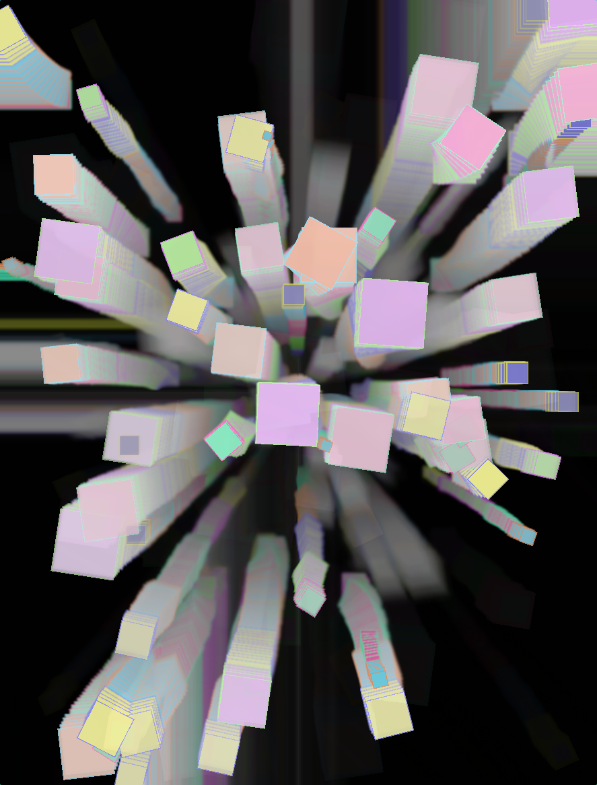
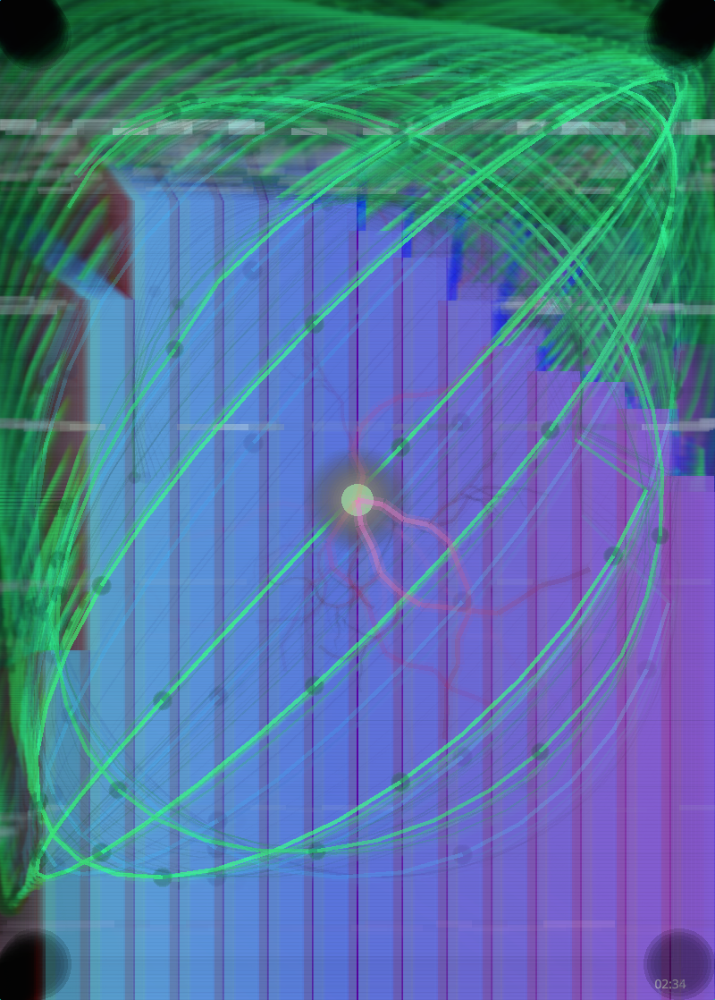
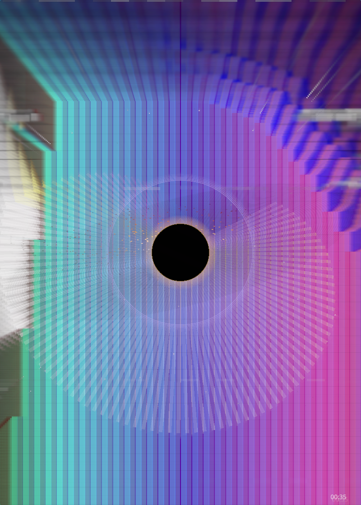
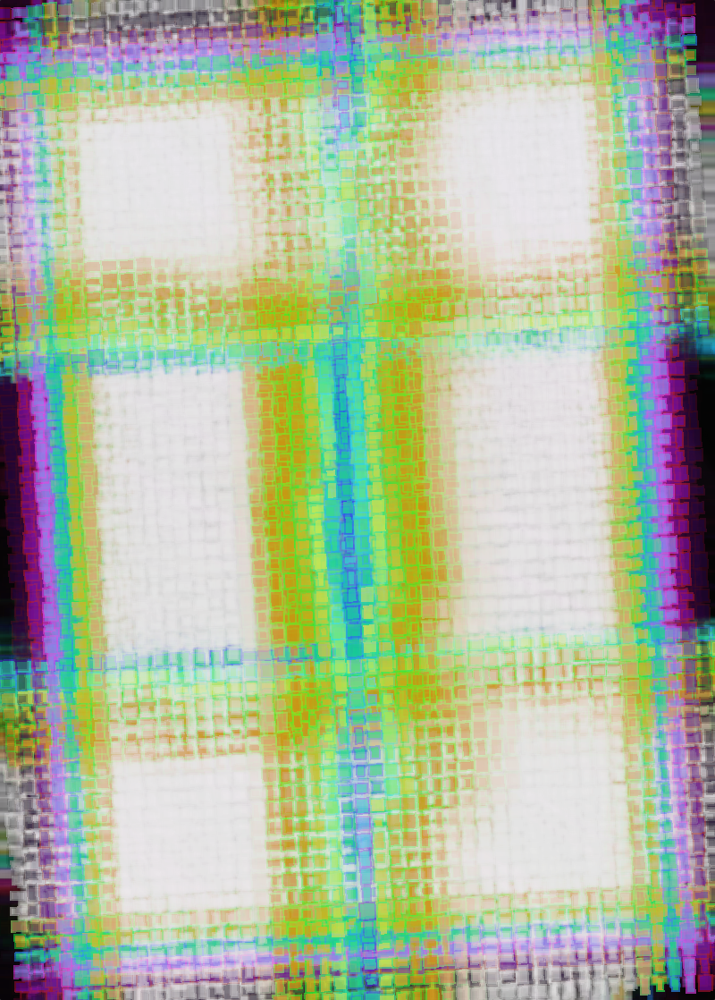
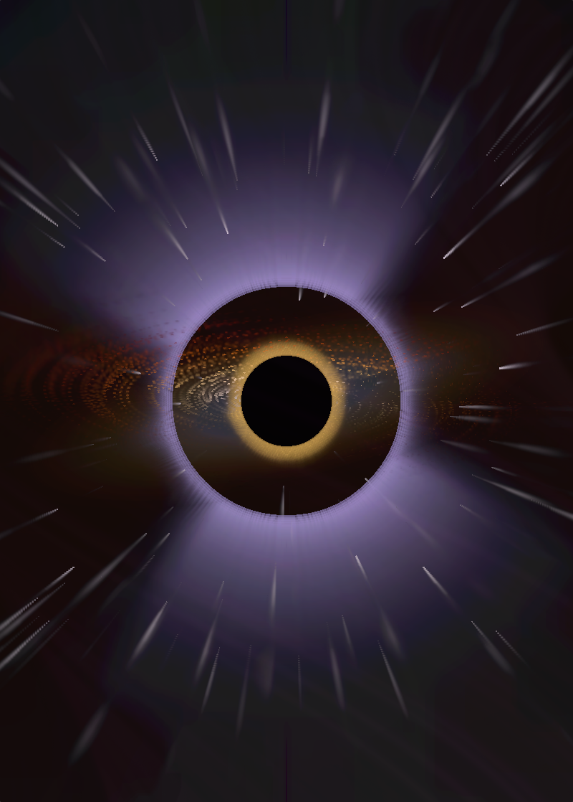
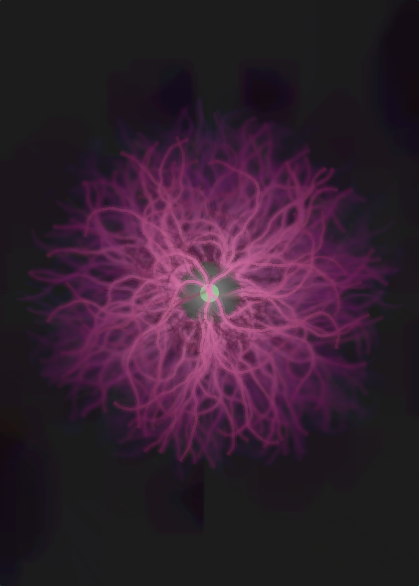
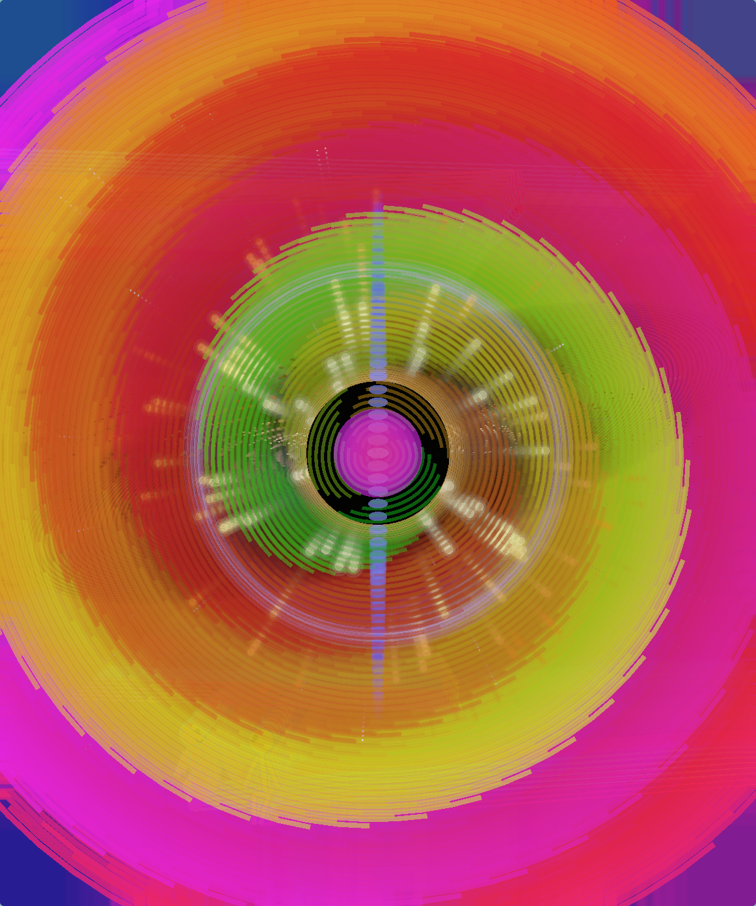
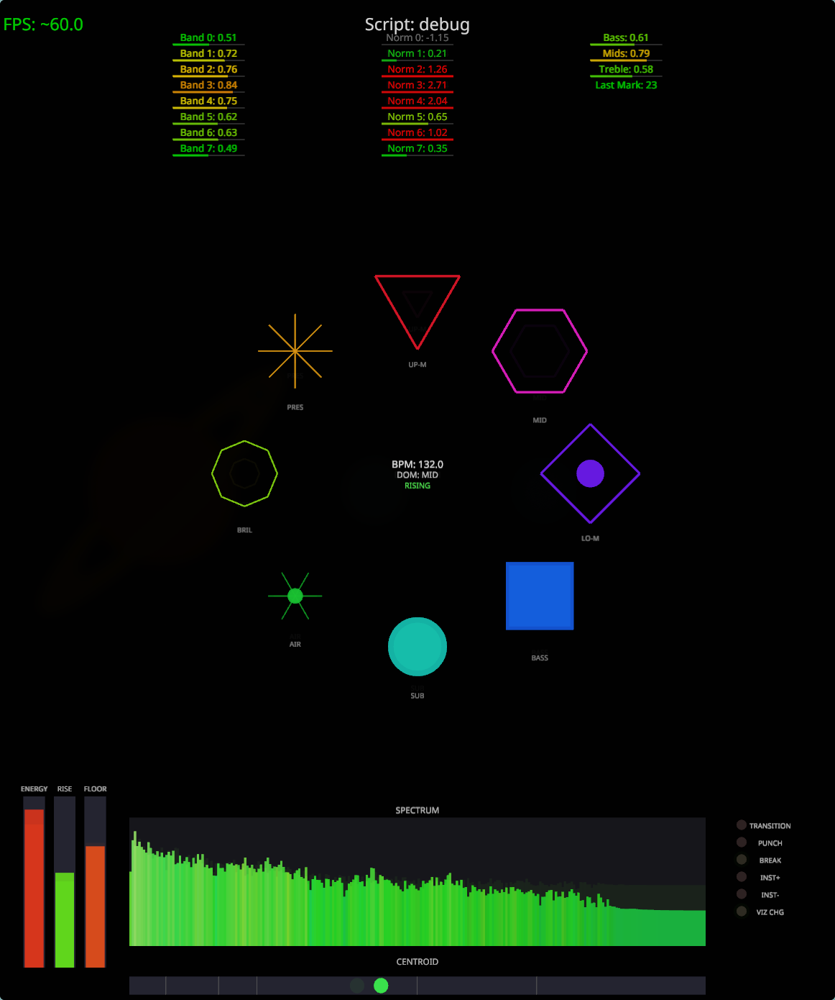

# dj-viz

[](https://github.com/zeachco/dj-viz/actions/workflows/build.yml)

Real-time audio visualizer built with Rust and nannou.

## Download

Pre-built binaries are available for download in [Releases](../../releases) - click on the latest successful run and download artifacts for your platform:

- **dj-viz-linux-x86_64** - Linux (x86_64)
- **dj-viz-linux-aarch64** - Raspberry Pi 4+ (64-bit)
- **dj-viz-linux-armv7** - Raspberry Pi 3/Zero (32-bit)
- **dj-viz-windows-x86_64** - Windows (x86_64)

## Build from source

### Native build

```bash
cargo build --release
```

### Platform-specific dependencies

**Linux (Debian/Ubuntu):**
```bash
sudo apt-get install libasound2-dev libudev-dev pkg-config
```

**Windows:**
No additional dependencies required (WASAPI is built-in).

**macOS:**
No additional dependencies required (CoreAudio is built-in).

### Cross-compilation

Use [cross](https://github.com/cross-rs/cross) for cross-compiling to other platforms:

```bash
# Install cross
cargo install cross --git https://github.com/cross-rs/cross

# Build for Raspberry Pi 4+ (64-bit)
cross build --release --target aarch64-unknown-linux-gnu

# Build for Raspberry Pi 3/Zero (32-bit)
cross build --release --target armv7-unknown-linux-gnueabihf
```

Binaries will be in `target/<target>/release/dj-viz`.

### All supported targets

| Target | Platform | Build command |
|--------|----------|---------------|
| `x86_64-unknown-linux-gnu` | Linux x86_64 | `cargo build --release` |
| `aarch64-unknown-linux-gnu` | Linux ARM64 / RPi 4+ | `cross build --release --target aarch64-unknown-linux-gnu` |
| `armv7-unknown-linux-gnueabihf` | Linux ARMv7 / RPi 3 | `cross build --release --target armv7-unknown-linux-gnueabihf` |
| `x86_64-pc-windows-msvc` | Windows x86_64 | `cargo build --release` (on Windows) |
| `x86_64-apple-darwin` | macOS Intel | `cargo build --release` (on macOS) |
| `aarch64-apple-darwin` | macOS Apple Silicon | `cargo build --release` (on macOS) |

## Usage

```bash
cargo run --release        # Run fullscreen
cargo run                  # Run in debug window (400x300)
cargo run -- --audio-info  # Print audio device info
```

## Controls

| Key | Action |
|-----|--------|
| `h` | Show/hide keyboard shortcuts |
| `q` | Quit |

### Visualization

| Key | Action |
|-----|--------|
| `l` | Lock/unlock auto-cycling |
| `Space` | Cycle to random visualization |
| `Up/Down` | Open visualization picker / navigate |
| `Scroll` | Open visualization picker / navigate |
| `Enter` | Select visualization (in picker) |
| `t` | Toggle visualization as overlay (in picker) |
| `Left-click` | Select visualization (in picker) |
| `Right-click` | Toggle as overlay (in picker) |
| `Esc` | Close visualization picker |
| `d` | Toggle debug overlay |
| `s` | Cycle Rhai scripts |

### Audio Device Search

Press `/` to open an interactive device search interface:

| Key | Action |
|-----|--------|
| Type | Filter devices by name |
| `Backspace` | Delete last character |
| `Up/Down` | Navigate results |
| `Enter` | Select device |
| `Escape` | Cancel search |

### macOS Audio Capture Setup

**⚠️ macOS Disclaimer:** Unlike Linux, macOS does not natively support capturing system audio (loopback). You must install a virtual audio device:

```bash
brew install blackhole-2ch
```

After installation, **restart the Core Audio service** to make BlackHole visible:

```bash
sudo killall coreaudiod
```

Core Audio will automatically restart in a few seconds. If BlackHole still doesn't appear, restart your Mac.

Then create a **Multi-Output Device** in Audio MIDI Setup:
1. Open `/Applications/Utilities/Audio MIDI Setup.app`
2. Click `+` → "Create Multi-Output Device"
3. Check both your speakers/headphones AND BlackHole 2ch
4. Set your speakers as primary (checkmark on the left)
5. Set this Multi-Output Device as your system default output

Now dj-viz can capture system audio by selecting BlackHole as the input device (press `/` and search for "blackhole").

### PipeWire Stream Search (Linux)

Press `/` to open the stream search interface for capturing audio from specific applications (like Spotify):

| Key | Action |
|-----|--------|
| Type | Filter streams by name |
| `Backspace` | Delete last character |
| `Up/Down` | Navigate results (cycles) |
| `Enter` | Select and auto-connect |
| `Escape` | Cancel search |

The search shows both output and input PipeWire ports, with outputs listed first. Selected streams are auto-connected via `pw-link` and saved to config.

## Configuration

Audio device and PipeWire stream selections are saved to `~/.dj-viz.toml`.

## Screenshots

| | | |
|:---:|:---:|:---:|
|  |  |  |
|  |  |  |
|  |  |  |

## Debugger Script

You can press `S` to activate custom script written in Rhai script (lua like but for rust).

The debug overlay is a Rhai script itself, pressing `D` would show this overlay

 